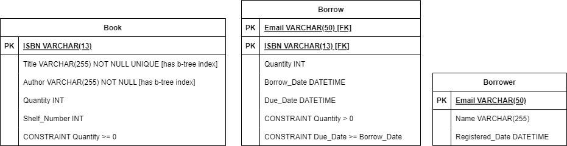

# Library Management System
This is a simple library management project implemented with:
1. Microsoft SQL Server
2. Node.js

## How to run?
1. Clone the repo
2. Open a terminal in the project root directory
3. Type `docker compose up --build` in the terminal, and run it
4. A docker compose stack, consisting of the backend and the database, will run

## API documentation
After running the docker compose stack, you can visit the **Swagger API documentation** page at `http://localhost:3000/api-docs`

## Environment Variables
You can find a list of the project environment variables in `.env` file in the project root directory. You can change them in the `.env` file or overwrite them in the environment as needed.

## Database Schema

## Project structure
The Database layer is the layer at which data is stored. In the DBMS, stored procedures layer was added to handle data CRUD operations logic. Only needed logic is implemented in the form of stored procedures. The repository layer wraps the stored procedures and exposes them as JS functions to the API layer. The repository checks the user input to protect the system from potential SQL injection attacks. The API layer is the one exposed to the users. It also makes some checks on the user input to reject invalid inputs.

